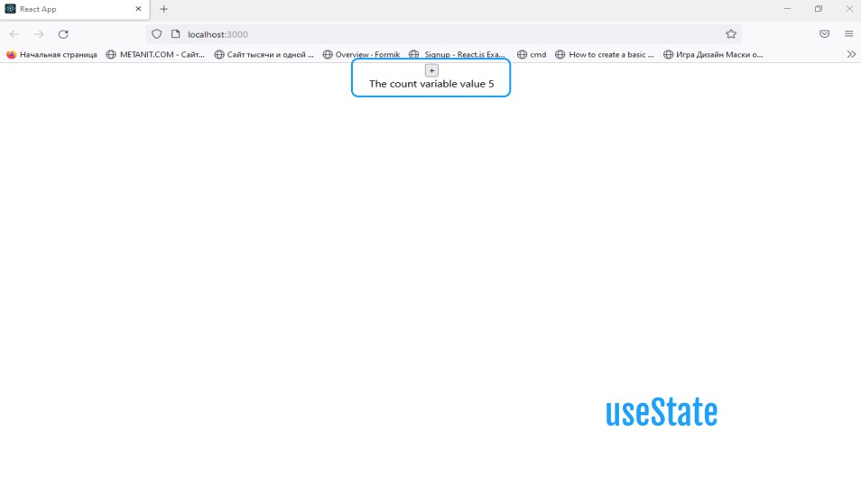
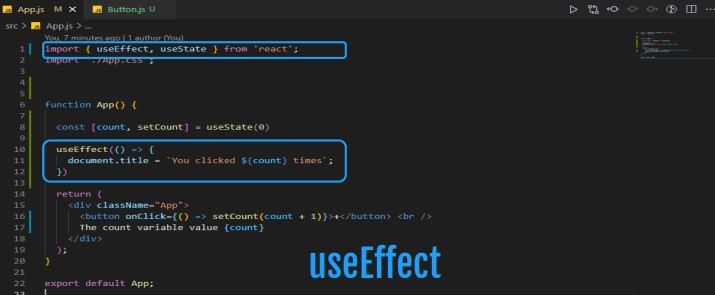
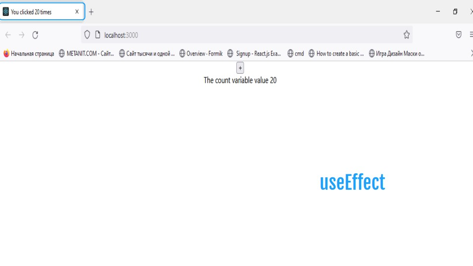

# UseState

## The useState hook is a special function that takes the initial state as an argument and returns an array of two entries.

(russian language)
## Хук useState — это специальныйфункция, принимающая начальныйвысказывание в качестве аргумента ивозвращает массив из двух записей.

# UseEffect

## React useEffect is a function that gets executed for 3 different React component lifecycles.

(rusiian language)
## React useEffect — это функция, которая выполняется для трех разных жизненных циклов компонентов React.

## Those lifecycles are componentDidMount, componentDidUpdate, and componentWillUnmount lifecycles.

(russian language)
## Этими жизненными циклами являются жизненные циклы componentDidMount, componentDidUpdate и componentWillUnmount.

# Rules to Remember

## Don’t call Hooks inside loops, conditions, or nested functions. Instead, always use Hooks at the top level of your React function, before any early returns.

(russian language)
## Не вызывайте крючки внутрициклы, условия или вложенные функции. Вместо этого всегда использовать хуки на верхнем уровне ваша функция React, прежде чемлюбой досрочный возврат.
